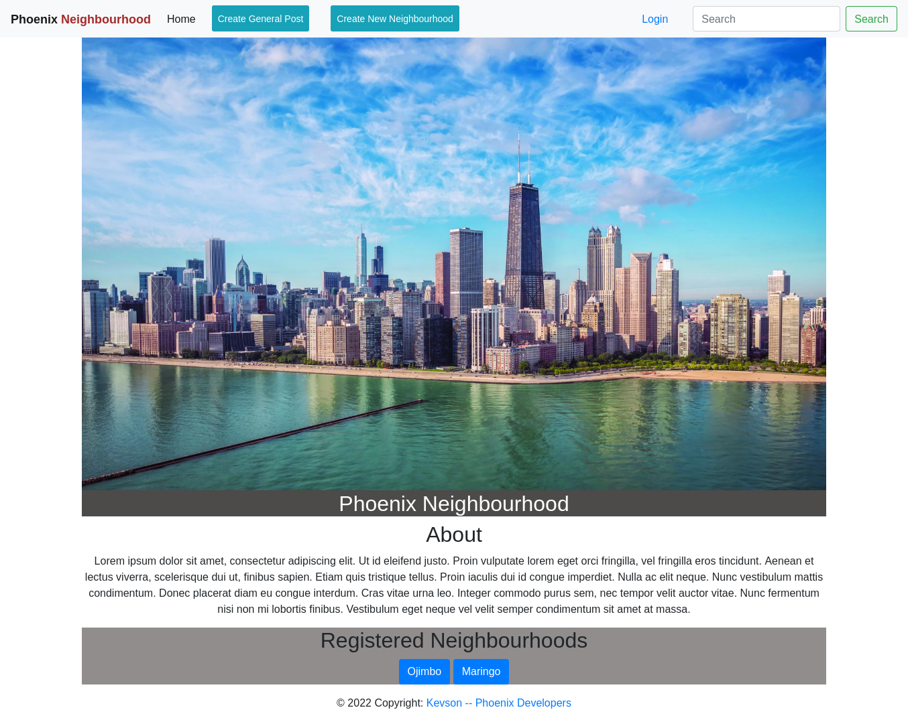
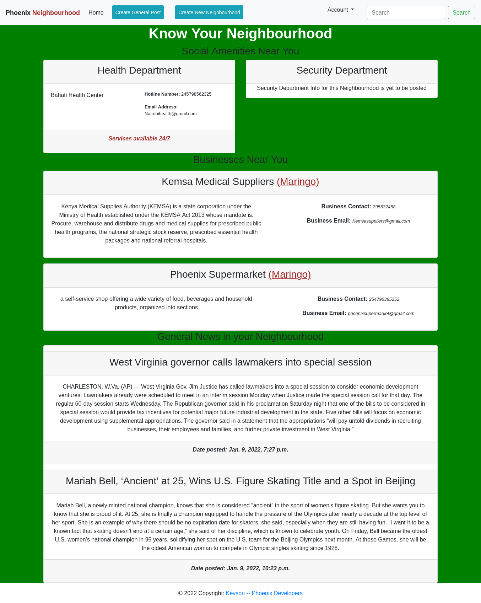

# Nbd-Phoenix

# Author
Built by: Nyambura Kelvin Njuguna

# Description
This Repository holds a Neighbourhood application where the user can view key and important information about their neighbourhood after logging into the application. The user can also post information that they may wish about their neighbourhood for others to see.

## User Story
The user can:
* Sign in with the application to start using.
* Set up a profile about me and a general location and my neighborhood name.
* Find a list of different businesses in my neighborhood.
* Find Contact Information for the health department and Police authorities near my neighborhood.
* Create Posts that will be visible to everyone in my neighborhood.
* Change My neighborhood when I decide to move out.
* Only view details of a single neighborhood.

# Design
### Home page

### Neighbourhood Information page

# Prerequisites
* python3.9
* pip
* Django

# Cloning
Open Terminal:

  $ git clone https://github.com/Kevson102/Nbd-Phoenix.git

  $ cd Nbd-Phoenix
  
  $ code . or atom . based on your text editor 
  
# Install all dependencies in requirements.txt

  $ pip install -r requirements.txt
  
# Running the Application
* Create the .env file and register all environment variables
  * Note: if your are running the project locally, set the MODE as "dev", and if you are running it in production, set MODE to "prod".
* To run the application, open the cloned repo in terminal and run the following commands:

  $ python3.9 manage.py runserver

# Technologies Used
python 3.9
django
Django-Bootstrap4
Heroku - online deployment

Support and contact details
Incase of any issues at hand, please email me at kevson3941@gmail.com

# License
<a href="Licence" target="_blank">MIT License.</a>
